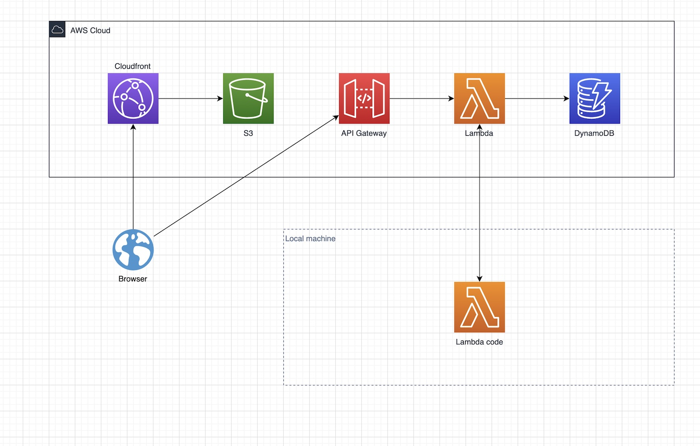

# Serverless Todo App Demo

A simple demo of a REST API and static website, running on top of AWS' serverless services. 
the [Serverless Stack](https://serverless-stack.com/) (SST) CDK extensions are used to manage
our infrastructure and provide a great local development experience. 

The app itself is a react application based on [TodoMVC](https://todomvc.com/), modified
to use a REST API for persistence. The REST API is provided by a combination of 
[Amazon API Gateway](https://aws.amazon.com/api-gateway/), [AWS Lambda](https://aws.amazon.com/lambda/),
and [Amazon DyanmoDB](https://aws.amazon.com/dynamodb/). The website is deployed to [Amazon S3](https://aws.amazon.com/s3/),
fronted by [Amazon CloudFront](https://aws.amazon.com/cloudfront/). 

SST lets us [run and debug our entire application on our desktop](https://docs.serverless-stack.com/live-lambda-development), 
while still running against AWS infrastructure. This lets us maintain a optimal developer experience without having to sacrifice the power and flexibility of the cloud.


**Architecture Overview**

## Project Layout
The repository contains 2 primary branches:

* **main** - contains the complete, working application and stack
* **workshop** - contains the structure of the app and stack, and some hints on how to get it going. 

If you are working through this in a workshop context, you should start with `workshop`, and only peak at `main` if 
you get stuck. Open [MyStack.ts](stacks/MyStack.ts) and get started! You need to fill in the missing resources in this
file and will end up with a working TODO application as described in this README.


## Usage

**1. Setup Dependencies**
```bash
# If we don't have yarn, we should install it
npm install -g yarn

# ... install the dependencies for the SST project itself
yarn install

# ... and install the dependencies for our frontend webapp
cd src/frontend
yarn install
```

**2. Start SST**
```bash
# Start localdev mode. This deploys the SST debug stack to AWS, passing all of 
# the requests for our running API back to our local environment, where we can
# quickly edit and debug.
npx sst start
```

At this point, you'll see an API URL printed to the console, which you can go
and hit (e.g., `http://my-url/api/v1/todos`). This URL will hit the API Gateway
in the cloud, but ultimately execute against your local version of the code - 
the API stored in [src/api/lambda.ts](src/api/lambda.ts) - and you can go and 
edit this to see the changes immediately!

**3. Start the frontend**
If you look at [src/frontend/package.json](src/frontend/package.json), you'll see that
the `start` NodeJS target is augmented with an `sst` helper. This injects our environment
configuration into the environment of the react app, so that requests to the API hit our
AWS-deployed API. 

When we are running `sst start` mode, that means that we can break into and debug both our frontend
code and our API code from our local editor.

```bash
cd src/frontend
yarn start
```

The frontend is now running locally but hitting your cloud API (and your local dev
environment from above). Again, you can go and edit the code and see

**3. Deploy complete application**

`sst start` is great for local development, but at some point you'll need to deploy the application to run
_normally_ in the cloud. For this, we simply use:
```
npx sst deploy --stage production
```
The `--stage` parameter lets us deploy a separate, named, copy of the application, keeping the stack we use
for local development separate from e.g. our production environment.
 what happens.
